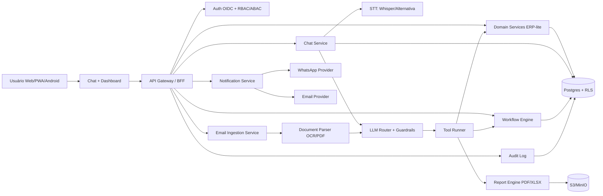

# Arquitetura e Stack Completa — Chatbot Operacional + Dashboard (Multi-tenant)

## 1) Contexto consolidado da conversa

Este documento traduz a conversa completa enviada para um plano técnico executável.
Objetivo do produto:

- Um **chatbot operacional** (texto + áudio) para uso diário no celular.
- Um **dashboard principal** de operação/admin.
- Ambos sobre o mesmo core de dados, governança e auditoria.
- Capacidade de automação com aprovação/quórum para ações críticas.
- Integração de e-mail corporativo com leitura/classificação por IA, extração de anexos, sugestão de resposta e notificação no WhatsApp.

---

## 2) Princípios de arquitetura

1. **Chat-first**: usuário resolve quase tudo no chat.
2. **Core único de regras**: chatbot e dashboard usam as mesmas APIs de domínio.
3. **Segurança por padrão**: nenhuma interface acessa DB diretamente.
4. **Governança explícita**: mutações sensíveis passam por aprovação.
5. **Acessibilidade real de campo**: UX para público leigo/mecânicos (botões grandes, alto contraste, baixo atrito).

---

## 3) Blueprint técnico (alto nível)

---

## 4) Stack recomendada + alternativas

## 4.1 Frontend

**Recomendado**
- Next.js + TypeScript
- Tailwind + design system acessível
- PWA como base (instalável)
- Capacitor para empacotar Android quando necessário

**Alternativas**
- React Native (mais nativo cedo)
- Flutter (consistência visual forte)

## 4.2 Backend e dados

**Recomendado**
- FastAPI (Python) para integração IA/ETL rápida
- Postgres + RLS para multi-tenant seguro
- pgvector para RAG sem banco extra no MVP
- Redis (cache/rate-limit)
- S3/MinIO (anexos/relatórios)

**Alternativas**
- NestJS (Node) para time JS fullstack
- Go para serviços de alta performance específicos

## 4.3 Orquestração (aprovação, jobs, SLAs)

**Recomendado**
- Temporal (robustez enterprise) ou Conductor (modelo worker forte)

**Alternativa MVP**
- Celery + Redis + cron (rápido), migrando depois

## 4.4 IA e áudio

**Recomendado**
- STT: Whisper (self-host/API)
- LLM Router: OpenAI/Anthropic/Gemini via camada de abstração
- Guardrails: schema validation + policy gate + allowlist de tools

## 4.5 WhatsApp (notificações e interação)

Opções principais:
- Meta WhatsApp Business Platform (Cloud API)
- Twilio WhatsApp
- BSPs regionais (Zenvia, 360dialog, Take Blip)

Estratégia:
- MVP com provedor de menor fricção operacional
- fase 2/escala avaliando custo por conversa/template e SLA

## 4.6 E-mail (ingestão + envio)

**Entrada (inbound)**
- Microsoft Graph (M365), Gmail API ou IMAP controlado
- Webhook/polling com marcação de processamento idempotente

**Saída (outbound transacional)**
- SES, Postmark, SendGrid, Mailgun

---

## 5) Fluxo de e-mail inteligente (pedido central da conversa)

1. Captura e-mail da caixa corporativa.
2. Classifica intenção/criticidade/destinatário interno.
3. Processa anexos (PDF, imagem, planilha), extrai entidades/dados.
4. Aplica regras de roteamento:
   - só proprietário,
   - financeiro,
   - compras,
   - jurídico, etc.
5. Gera:
   - resumo executivo,
   - pontos de ação,
   - sugestão de resposta (template).
6. Se regra exigir: abre workflow de aprovação/tarefa.
7. Notifica via WhatsApp/e-mail/app conforme perfil.
8. Persiste trilha completa em audit log.

---

## 6) Modelo de governança para ações críticas

Ações críticas (exemplo): alteração de preço, desconto acima de limite, troca de fornecedor padrão, aprovação de orçamento alto.

Pipeline de mutação:
- preview de mudança (antes/depois)
- checagem de política
- aprovação N-de-M (ex.: 2 admins)
- execução transacional
- auditoria imutável
- notificação de conclusão

---

## 7) UX e acessibilidade (perfil mecânico/leigo)

Padrões obrigatórios:
- área de toque mínima 56px
- tipografia base 18px com modo ampliado
- contraste AA/AAA + modo alto contraste
- fluxo com botões de ação claros e poucos passos
- linguagem simples e orientada a tarefa
- confirmação explícita para ações de risco
- feedback visual/sonoro de sucesso/erro

---

## 8) Entregáveis técnicos para iniciar build na IDE

1. Monorepo com apps:
   - `apps/chat`
   - `apps/dashboard`
   - `apps/api`
2. Serviços:
   - `services/email-ingestion`
   - `services/notification`
   - `services/workflow`
3. Pacotes comuns:
   - `packages/contracts` (schemas/eventos)
   - `packages/policies`
   - `packages/design-system`
4. Infra:
   - `docker-compose.dev.yml`
   - observabilidade base

---

## 9) Roadmap enxuto

## Fase 0 (1-2 semanas)
- Contratos de dados e políticas
- Auth multi-tenant + RLS
- Chat base + tool runner seguro

## Fase 1 (2-4 semanas)
- Inbound e-mail
- resumo + sugestão de resposta
- notificação WhatsApp
- 1 fluxo de aprovação 2-de-2

## Fase 2 (4-8 semanas)
- dashboard operacional completo
- KPIs + relatórios
- worker specs configuráveis

## Fase 3
- conectores ERP legado
- otimização de custo IA por tenant
- hardening de observabilidade/auditoria

---

## 10) Gaps que devem ser fechados antes da produção

- Política formal de retenção de e-mails e anexos por tenant.
- Classificação de dados sensíveis e estratégia de redaction.
- Plano de contingência para falha de provedor WhatsApp.
- Testes de autorização por papel + tenant para 100% das mutações.
- Catálogo de prompts/versionamento/avaliação de qualidade do agente.
